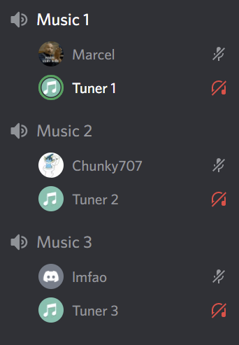
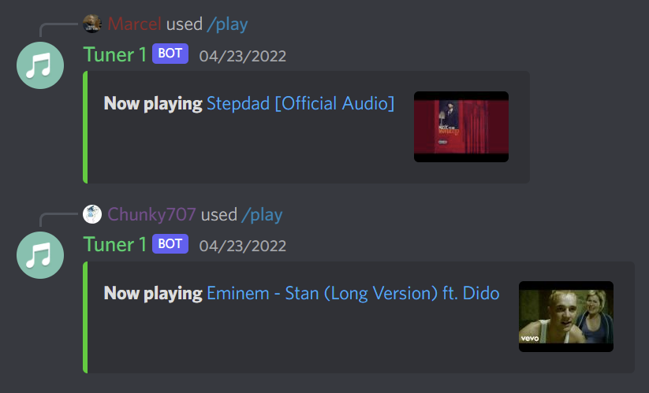
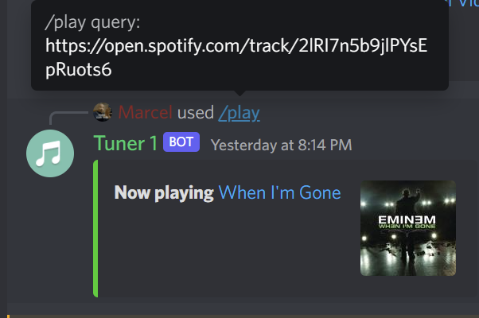

# Tuner

Discord Multi-Token Musicbot written in Java & Kotlin using [JDA](https://github.com/DV8FromTheWorld/JDA)

**!!! This project is still WIP and is lacking many features !!!**

## Features
<ul>
  <li>Supports multiple bot-tokens</li>
  <li>Only one bot will create the commands per guild</li>
  <li>Easily extendable: Not enough bots? Add another one in the config and invite it!</li>
  <li>Easy to use: Just hop in a channel and use the /play command, if no bot is currently playing music, an available bot will join your channel, otherwise it will return an error, if no other bot is available.</li>
</ul>

### Spotify Support

Tuner can play spotify links! Just provide a spotify application client id and secret in the `config.yml` file that gets created after first starting the bot, and you should be good to go!

### Building

1. Clone repository: `git clone https://github.com/Xirado/Tuner`
2. Go into working directory: `cd Tuner`
3. Compile: `./gradlew shadowJar` on Linux/MacOS or `.\gradlew shadowJar` on Windows
4. Go into output directory: `cd build/libs`
5. Run: `java -jar Tuner-VERSION-all.jar` (Replace VERSION with whatever version it has)

 
